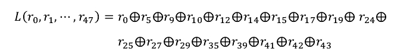
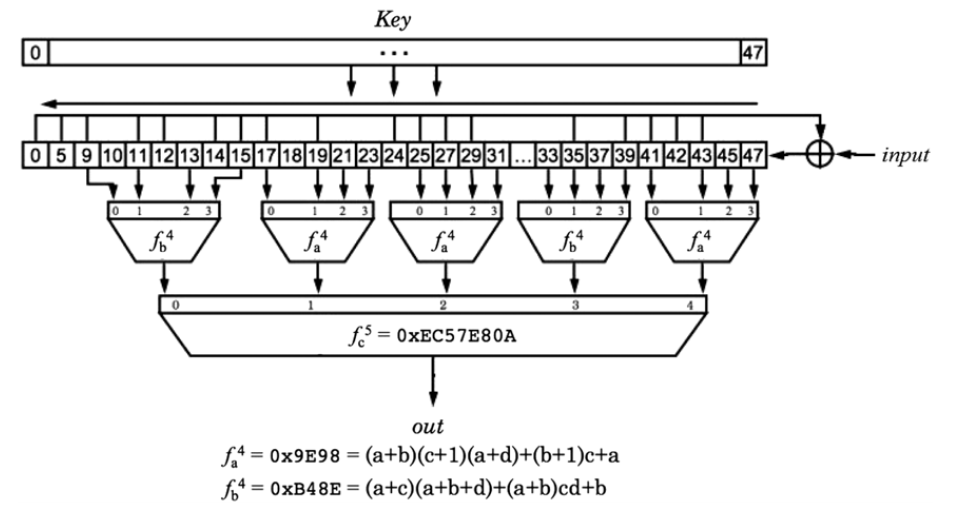
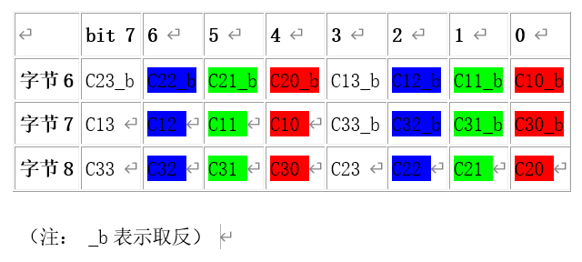
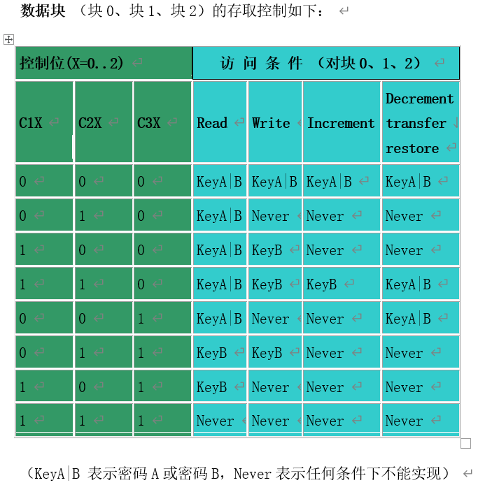
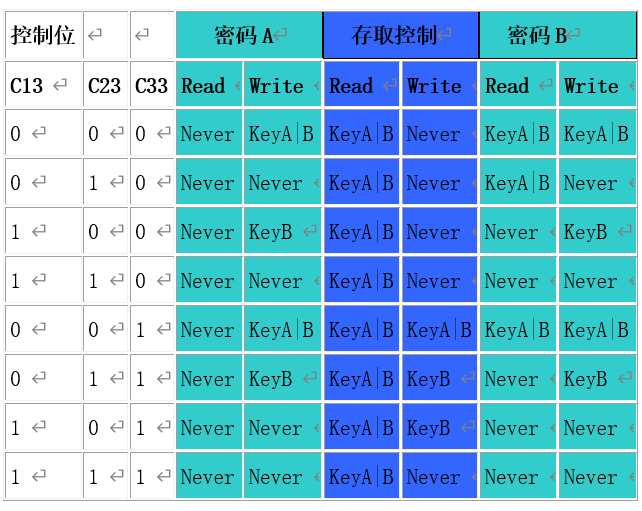

# 笔记2 2019.9.16
两个研究的方向（待研讨）

### 1.Crypto-1算法的研究

这个角度来看，国内在CNKI上检索该关键词仅能检索出两篇论文，一篇是上交大的博士学位论文，另外一篇是国人发表在外国刊物上的英文论文。

如果我们考虑这个角度的话，发表论文可否选择为一个角度？但必须考虑的一个问题是，现有的PM3已经可以帮我们完成这一步，并且这个选题是几年前的了，刊物是否会选用？

以下为论文摘抄：

这是一个滤波流密码，由一个 48 比特的线性反馈移位寄存器(LFSR)和一个非线性函数组成，其中线性反馈移位寄存器的反馈多项式为𝐿: 𝔽248→ 𝔽2 

非线性函数𝑓: 𝔽248→ 𝔽2定义为：

𝑓(𝑟0, 𝑟1, ⋯ , 𝑟47) = 𝑓𝑐(𝑓𝑎(𝑟9,𝑟11, 𝑟13, 𝑟15), 𝑓𝑏(𝑟17, 𝑟19, 𝑟21, 𝑟23), 𝑓𝑏(𝑟25, 𝑟27, 𝑟29,𝑟31), 𝑓𝑎(𝑟33, 𝑟35, 𝑟37, 𝑟39), 𝑓𝑏(𝑟41, 𝑟43, 𝑟45, 𝑟47)) 

其 中 𝑓𝑎:  𝔽24→ 𝔽2, 𝑓𝑎(𝑥0,𝑥1, 𝑥2, 𝑥3) = 0x26𝑐7 ， 𝑓𝑏:  𝔽24→ 𝔽2, 𝑓𝑏(𝑥0, 𝑥1, 𝑥2, 𝑥3) = 0x0𝑑𝑑3 ，𝑓𝑐:  𝔽25→ 𝔽2, 𝑓𝑐(𝑥0,𝑥1, 𝑥2, 𝑥3, 𝑥4) = 0x4457𝑐3𝑏3。这里𝑓𝑎(𝑥0,𝑥1, 𝑥2, 𝑥3)=0x26𝑐7表示𝑓𝑎(1,1,1,1)，𝑓𝑎(1,1,1,0)，…，𝑓𝑎(0,0,0,0)的取值分别为 0x26c7=(0010101011000111)2从左至右的比特数，𝑓𝑏、𝑓𝑐同上。生成的密钥流如下： 

𝑏𝑖= 𝑓(𝑟𝑖,𝑟𝑖+1, ⋯ , 𝑟𝑖+47) = 𝑓(𝑟𝑖+9,𝑟𝑖+11, ⋯ , 𝑟𝑖+47)，i ≥ 0

### 2.跳过底层直接对控制位的存取控制进行研究

#### 存储结构
M1卡分为16个扇区，每个扇区4块（块0～3），共64块，按块号编址为0～63。第0扇区的块0（即绝对地址0块）用于存放厂商代码，已经固化，不可更改。其他各扇区的块0、块1、块2为 数据块 ，用于存贮数据；块3为 控制块 ，存放密码A、存取控制、密码B，其结构如下： 

>A0A1A2A3A4A5 密码A(6字节) 
FF 07 80 69 存取控制(4字节)
B0B1B2B3B4B5 密码B(6字节)

#### 控制属性

每个扇区的密码和存取控制都是独立的，可以根据实际需要设定各自的密码及存取控制。在 存取控制 中每个块都有相应的三个 控制位 ,定义如下： 
块0： C10 C20 C30 
块1： C11 C21 C31 
块2： C12 C22 C32 
块3： C13 C23 C33 
三个控制位以正和反两种形式存在于存取控制字节中，决定了该块的访问权限（如进行减值操作必须验证KEY A，进行加值操作必须验证KEY B，等等）。三个控制位在存取控制字节中的位置如下（字节9为备用字节，默认值为0x69）：

其中，白色区控制 块3 ，蓝色区控制 块2 ，绿色区控制 块1 ，红色区控制 块0 。 

例如：当块0的存取控制位C10 C20 C30=100时，验证密码A或密码B正确后可读；验证密码B正确后可写；不能进行加值、减值操作。 

控制块 （块3）的存取控制与 数据块 （块0、1、2）不同，它的存取控制如下：

例如：当块3的存取控制位C13 C23 C33=100时，表示： 
密码A： 不可读，验证KEYB正确后，可写（更改）。 
存取控制：验证KEYA或KEYB正确后，可读不可写。 
密码B： 不可读，验证KEYB正确后，可写。 

  

